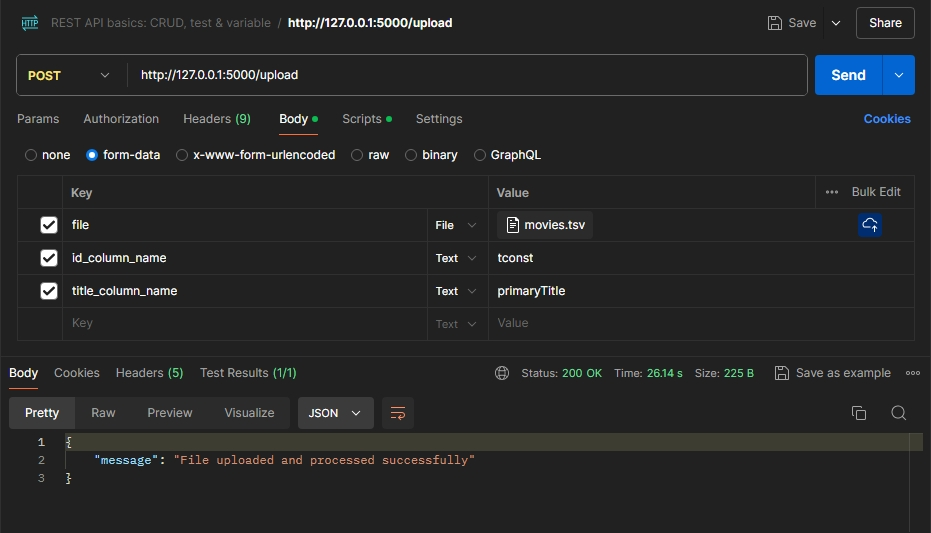
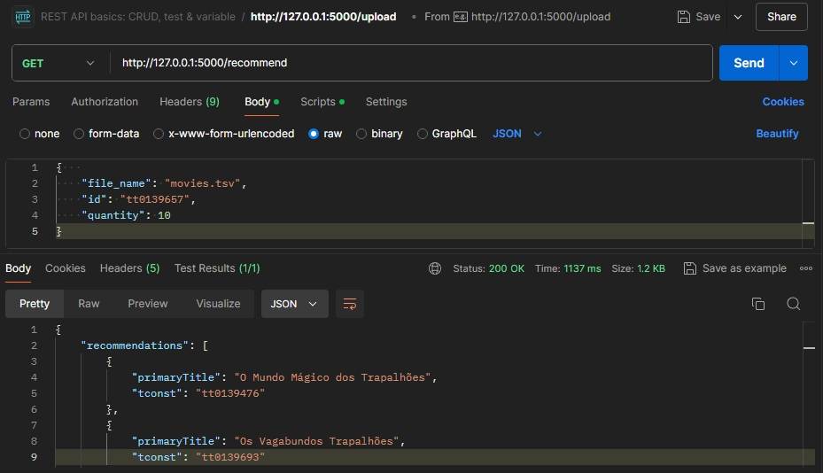
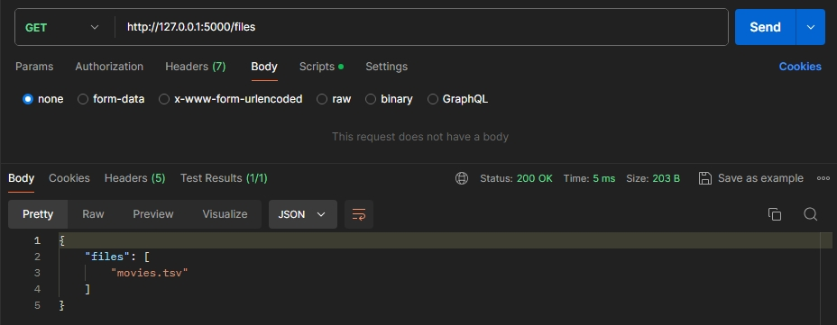
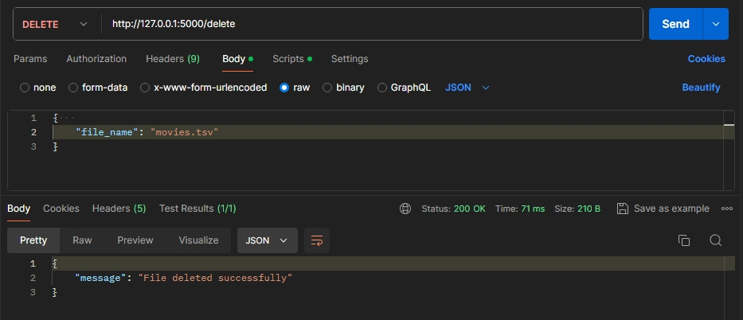

# API de Recomendações de Mídia 🎥🎵

Este projeto é um serviço de recomendação de mídia (filmes, séries, músicas, etc.) que utiliza Machine Learning para recomendar mídias com base em um título fornecido. O usuário pode utilizar sua própria base de dados para obter recomendações personalizadas. 📈

## Funcionalidades 🌟

### Upload 📤

- O usuário pode fazer o upload de um arquivo CSV contendo os dados de mídias que deseja utilizar para obter recomendações personalizadas.



### Recomendação 🎯

- O usuário pode obter recomendações de mídias com base em um título fornecido.



### Visualização de Arquivos 👀

- O usuário pode visualizar os arquivos que foram enviados para o sistema.



### Deletar Arquivos 🗑️

- O usuário pode deletar arquivos que foram enviados para o sistema.



## Tecnologias 🛠️

- Python 🐍
- Flask 🌐
- Pandas 🐼
- Scikit-learn 🤖
- Numpy 🔢

## Como Rodar o Projeto Localmente 🚀

1. Clone o repositório:
    ```sh
    git clone https://github.com/seu-usuario/api-recomendacoes-midia.git
    ```

2. Entre no diretório do projeto:
    ```sh
    cd api-recomendacoes-midia
    ```

3. Crie um ambiente virtual:
    ```sh
    python3 -m venv venv
    ```

4. Ative o ambiente virtual:
    - No Windows:
        ```sh
        venv\Scripts\activate
        ```
    - No MacOS/Linux:
        ```sh
        source venv/bin/activate
        ```

5. Instale as dependências:
    ```sh
    pip install -r requirements.txt
    ```

6. Execute o arquivo `app.py`:
    ```sh
    python app.py
    ```

## Licença 📄

Este projeto está licenciado sob a licença MIT - veja o arquivo [LICENSE.md](LICENSE) para mais detalhes.